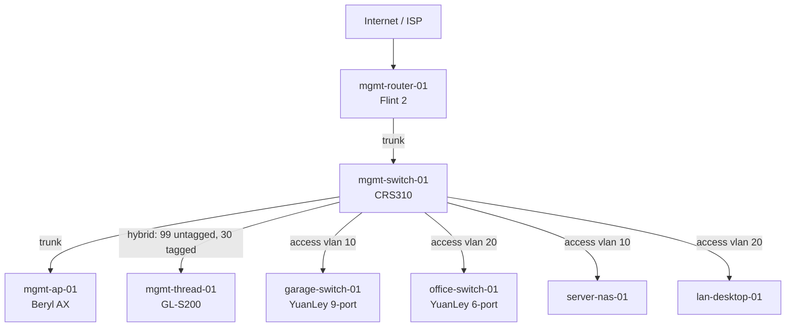

<!-- Generated by scripts/generate-docs.py from templates/physical-topology.md.j2 -->
<!-- Edit the template or data files in data/, not this file directly -->

# Physical Topology

This document covers hardware placement and port use. The port inventory in `data/network/ports.yaml` is the authoritative version.

## Placement

- Garage rack: Flint 2, CRS310, server infrastructure, garage YuanLey switch.
- Office: Beryl AX, GL-S200, office YuanLey switch.

## Logical Topology

## Port Plan

### Flint 2

| Port | Peer | Mode | VLANs | Notes |
| ---- | ---- | ---- | ---- | ---- |
| `2.5g-wan` | isp-handoff | wan | n/a | Primary internet uplink |
| `2.5g-wan-lan` | mgmt-switch-01:ether1 | trunk | `10,20,30,40,50,60,99` | Single internal uplink |
### CRS310

| Port | Peer | Mode | VLANs | Notes |
| ---- | ---- | ---- | ---- | ---- |
| `ether1` | mgmt-router-01:2.5g-wan-lan | trunk | `10,20,30,40,50,60,99` | Router uplink |
| `ether2` | mgmt-ap-01:wan | trunk | `20,40,50,60,99` | Office AP uplink |
| `ether3` | mgmt-thread-01:uplink | hybrid | native `99`, tagged `30` | Management on VLAN 99, IoT client traffic on VLAN 30 |
| `ether4` | garage-switch-01:uplink | access | `10` | Garage downstream switch for server gear only |
| `ether5` | office-switch-01:uplink | access | `20` | Office downstream switch for trusted clients only |
| `ether6` | unassigned | access | unassigned | Spare for staging or bench access |
| `ether7` | unassigned | access | unassigned | Spare for staging or bench access |
| `ether8` | unassigned | access | unassigned | Spare for staging or bench access |
| `sfp-sfpplus1` | server-nas-01 | access | `10` | NAS 10G uplink |
| `sfp-sfpplus2` | lan-desktop-01 | access | `20` | Gaming desktop 10G uplink |
### Beryl AX

| Port | Peer | Mode | VLANs | Notes |
| ---- | ---- | ---- | ---- | ---- |
| `wan` | mgmt-switch-01:ether2 | trunk | `20,40,50,60,99` | Tagged uplink |
| `lan` | local-client-or-unused | access | `20` | Do not treat as a trunk handoff |
### GL-S200

| Port | Peer | Mode | VLANs | Notes |
| ---- | ---- | ---- | ---- | ---- |
| `uplink` | mgmt-switch-01:ether3 | hybrid | native `99`, tagged `30` | Validate management and IoT client separation on GL.iNet firmware |
### garage YuanLey

| Port | Peer | Mode | VLANs | Notes |
| ---- | ---- | ---- | ---- | ---- |
| `uplink` | mgmt-switch-01:ether4 | access | `10` | Unmanaged switch; single VLAN only |
### office YuanLey

| Port | Peer | Mode | VLANs | Notes |
| ---- | ---- | ---- | ---- | ---- |
| `uplink` | mgmt-switch-01:ether5 | access | `20` | Unmanaged switch; single VLAN only |
## Wireless Delivery

| SSID | VLAN | Device | State | Notes |
| ---- | ---- | ---- | ---- | ---- |
| `Meerkat Manor Admin` | 99 | Beryl AX | disabled, hidden | Break-glass only |
| `Meerkat Manor Admin` | 99 | Flint 2 | disabled, hidden | Break-glass only |
| `Meerkat Manor` | 20 | Beryl AX | enabled | Main trusted SSID |
| `Meerkat Manor Guest` | 40 | Beryl AX | enabled | Client isolation on |
| `Meerkat Manor TV` | 50 | Beryl AX | enabled | Routed through TV VPN policy |
| `Meerkat Manor Work` | 60 | Beryl AX | enabled | Client isolation on |
| `Meerkat Manor IoT` | 30 | GL-S200 | enabled | Dedicated IoT SSID |
## Unmanaged Switch Rule

The YuanLey switches are unmanaged. They stay on single-VLAN access ports only. They do not sit on trunks. If a downstream segment needs more than one VLAN, replace the switch.

## Hardware References

- [MikroTik CRS310-8G+2S+IN](https://mikrotik.com/product/crs310_8g_2s_in)
- [GL.iNet Flint 2](https://www.gl-inet.com/products/gl-mt6000/)
- [GL.iNet Beryl AX](https://www.gl-inet.com/products/gl-mt3000/)
- [GL.iNet GL-S200](https://www.gl-inet.com/products/gl-s200/)
